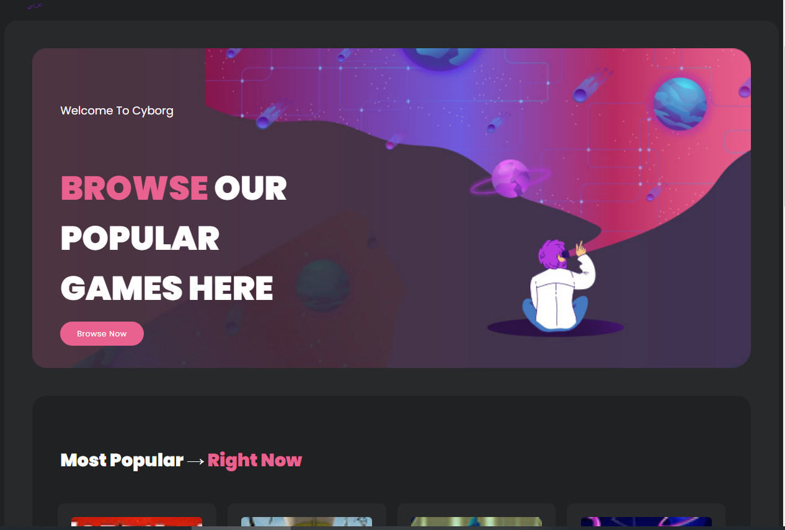

# Highlog 

## Overview

This project consists of a JavaScript backend, a React frontend, and responsive CSS for all devices. It features a collection of games with their details, including cover images, titles, information, ratings, and views.

## Games

Here are some of the featured games in this project:

1. **Fortnite**
   - Category: Sandbox
   - Rating: 3.8
   - Views: 2.3M

2. **Pubg**
   - Category: StreamX
   - Rating: 4.8
   - Views: 1.1M

3. **Dota2**
   - Category: Legendary
   - Rating: 2.7
   - Views: 5.3M

4. **Cs-Go**
   - Category: Battle S
   - Rating: 3.9
   - Views: 6.1M

5. **MinCraft**
   - Category: Epic
   - Rating: 1.8
   - Views: 29M

Feel free to explore these games in this project!

